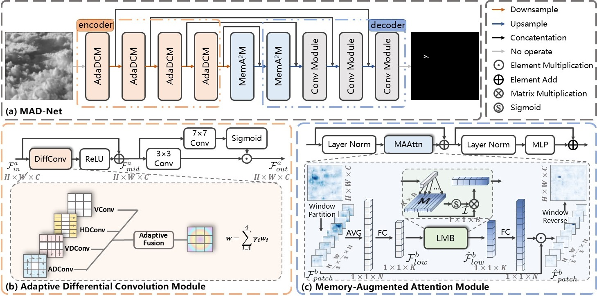

# [Memory-Augmented Differential Network for Infrared Small Target Detection](https://ieeexplore.ieee.org/document/10777476)
Traditional U-Net-based methods in Infrared Small Target Detection (IRSTD) have demonstrated good performance. However, they often struggle with challenges such as blurred contour and strong interference in complex backgrounds. To overcome these issues, we propose a Memory-Augmented Differential Network (MAD-Net), which integrates two key modules: the Adaptive Differential Convolution Module (AdaDCM) and the Memory-Augmented Attention Module (MemA<sup>2</sup>M). AdaDCM leverages multiple differential convolutions to capture detailed edge information, with an adaptive fusion mechanism to weight and aggregate these features. In the deeper layers, by introducing the dataset-level representations through a learnable memory bank (LMB), MemA<sup>2</sup>M can enhance current features and effectively mitigate background interference. Extensive experiments on four public IRSTD datasets demonstrate that MAD-Net outperforms state-of-the-art methods, showcasing its superior capability in handling complex scenarios.



## Installation
```angular2html
pip install -U openmim
mim install mmcv-full==1.7.0
mim install mmdet==2.25.0
mim install mmsegmentation==0.28.0
```

## Dataset Preparation
### File Structure
```angular2html
|- datasets
   |- NUAA-SIRST
      |-trainval
        |-images
          |-Misc_1.png
          ......
        |-masks
          |-Misc_1.png
          ......
      |-test
        |-images
          |-Misc_50.png
          ......
        |-masks
          |-Misc_50.png
          ......
   |-NUDT-SIRST
   |-IRSTD-1K
   |-SIRST-AUG

```
### Datasets Link
The datasets used in this project and the dataset split files can be downloaded from the following links:
* [NUAA-SIRST](https://openaccess.thecvf.com/content/WACV2021/papers/Dai_Asymmetric_Contextual_Modulation_for_Infrared_Small_Target_Detection_WACV_2021_paper.pdf)
  *
* [NUDT-SIRST](https://ieeexplore.ieee.org/stamp/stamp.jsp?arnumber=9864119)
  * 
* [IRSTD-1K](https://openaccess.thecvf.com/content/CVPR2022/papers/Zhang_ISNet_Shape_Matters_for_Infrared_Small_Target_Detection_CVPR_2022_paper.pdf)
  * 
* [SIRST-AUG](https://arxiv.org/pdf/2111.03580.pdf)
  * 

## Training

```
python train.py <CONFIG_FILE>
```

For example:

```
python train.py configs/abcnet/madnet_nudt.py
```

## Test

```
python test.py <CONFIG_FILE> <SEG_CHECKPOINT_FILE>
```

For example:

```
python test.py configs/abcnet/madnet_nudt.py work_dirs/abcnet_clft-s_256x256_1500e_nudt/20240805_122237/best.pth.tar
```

## Performance
<table>
<thead>
  <tr>
    <th rowspan="3">Model</th>
    <th colspan="3">NUAA-SIRST</th>
    <th colspan="3">NUDT-SIRST</th>
    <th colspan="3">IRSTD-1k</th>
    <th colspan="3">SIRST-AUG</th>
  </tr>
  <tr>
    <th>IoU</th>
    <th>nIoU</th>
    <th>F1</th>
    <th>IoU</th>
    <th>nIoU</th>
    <th>F1</th>
    <th>IoU</th>
    <th>nIoU</th>
    <th>F1</th>
    <th>IoU</th>
    <th>nIoU</th>
    <th>F1</th>
  </tr>
</thead>
<tbody>
  <tr>
    <td>ACM</td>
    <td>66.62</td>
    <td>66.26</td>
    <td>72.99</td>
    <td>67.65</td>
    <td>70.68</td>
    <td>74.71</td>
    <td>67.73</td>
    <td>68.34</td>
    <td>80.80</td>
    <td>61.62</td>
    <td>56.81</td>
    <td>62.45</td>
  </tr>
  <tr>
    <td>DNANet</td>
    <td>74.32</td>
    <td>73.09</td>
    <td>85.27</td>
    <td>85.49</td>
    <td>85.68</td>
    <td>92.17</td>
    <td>71.99</td>
    <td>68.28</td>
    <td>83.71</td>
    <td>65.03</td>
    <td>59.91</td>
    <td>78.80</td>
  </tr>
  <tr>
    <td>ISNet</td>
    <td>70.19</td>
    <td>70.26</td>
    <td>78.24</td>
    <td>74.26</td>
    <td>78.95</td>
    <td>85.23</td>
    <td>73.53</td>
    <td>71.36</td>
    <td>84.75</td>
    <td>59.31</td>
    <td>56.40</td>
    <td>74.46</td>
  </tr>
  <tr>
    <td>RDIAN</td>
    <td>68.19</td>
    <td>68.77</td>
    <td>81.09</td>
    <td>82.44</td>
    <td>83.50</td>
    <td>90.37</td>
    <td>72.00</td>
    <td>69.87</td>
    <td>83.72</td>
    <td>61.51</td>
    <td>58.27</td>
    <td>76.17</td>
  </tr>
  <tr>
    <td>RepISD-Net</td>
    <td>74.35</td>
    <td>72.32</td>
    <td>85.28</td>
    <td>87.88</td>
    <td>87.89</td>
    <td>93.55</td>
    <td>69.74</td>
    <td>64.54</td>
    <td>82.17</td>
    <td>66.92</td>
    <td>63.67</td>
    <td>78.19</td>
  </tr>
  <tr>
    <td>MAD-Net</td>
    <td>76.47</td>
    <td>73.96</td>
    <td>86.67</td>
    <td>88.98</td>
    <td>89.03</td>
    <td>94.17</td>
    <td>75.38</td>
    <td>71.56</td>
    <td>85.96</td>
    <td>68.68</td>
    <td>66.16</td>
    <td>81.41</td>
  </tr>
</tbody>
</table>

*The overall repository style is highly borrowed from [ABC](https://github.com/PANPEIWEN/ABC). Thanks to Peiwen Pan.
